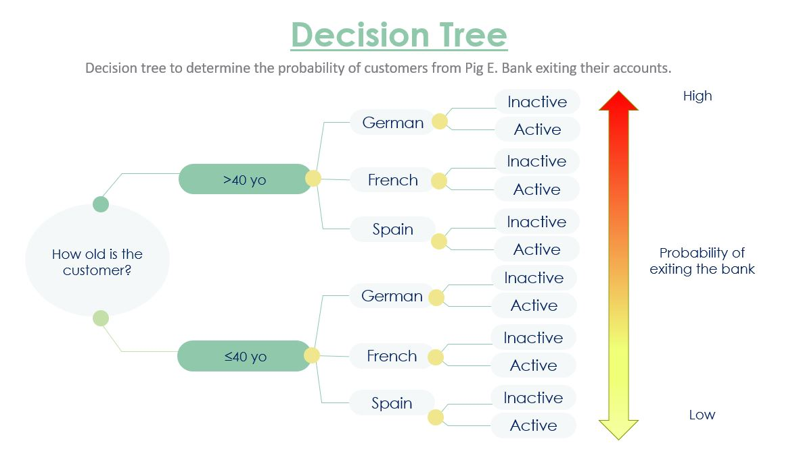

# Excel_customer_retention_bank_industry
This repository highlights Excel processes designed to support Pig E. Bank, a banking company with customers in France, Germany, and Spain, in creating a decision tree to enhance customer retention.

## Project Overview
### Motivation
To increase customer retention, the sales team at Pig E. Bank wants to identify the leading indicators that a customer will exit the bank.

### Objective
Based on a table of client attributes, including age, estimated salary, etc., the Management Board at Pig E. Bank would like to identify the top risk factors that contribute to client loss and model them in a decision tree.

### Scope
Identify the top 3 factors leading a customer to exit the bank.

## Dataset overview
Client attribute dataset: The dataset comprises observations from 991 clients, and 14 variables such as demographic, bank account details, and salary ranges.
  
## Excel processes
I conducted data cleaning, consistency checks, imputations, and basic statistical analyses on the provided dataset. Later, I pivoted the data into two groups those customers who exited and stayed in the bank. Here, 11 variables were assessed through percentage and average comparisons between the two groups. To support the significance difference between the two groups visuals and statistical testing analyses were performed. Click [here]() to access the Excel files containing the analysis. 
 
## Addressing business questions
Stakekholders were informed about the main data-driven findings with a [Word report](Interim_report_Nadia_Ordonez.pdf). 

Our recommendation to the client is to implement targeted promotions, exclusive offers, and enhanced customer engagement initiatives. This strategy aims to reignite the interest and loyalty of customers with a high probability of leaving the bank, particularly those aged 40 and above, primarily located in Germany, and typically displaying account inactivity.

                                                                                                          
## Project timeline
This data analysis project was completed within 5 days, using Excel for data analysis and Microsoft Word for reporting. 
